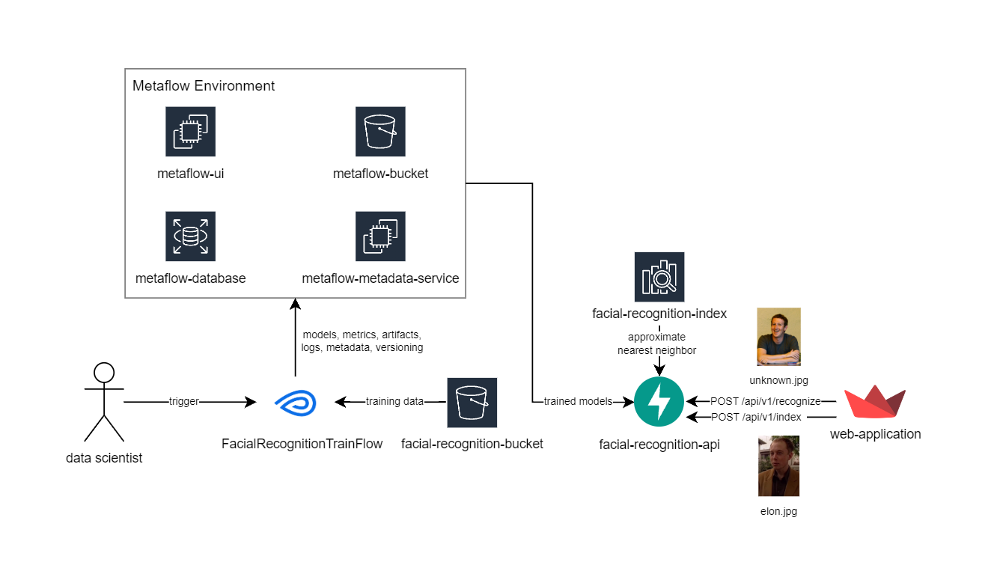
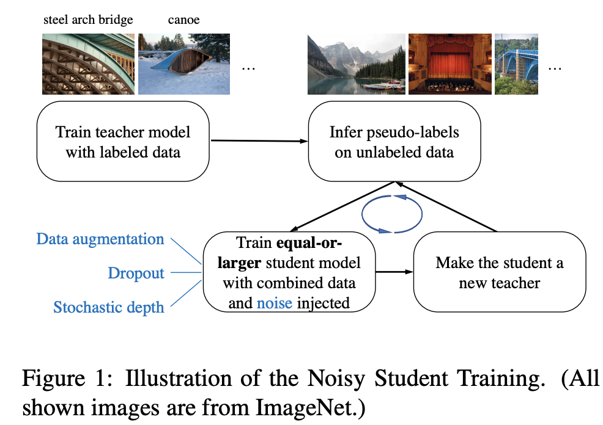
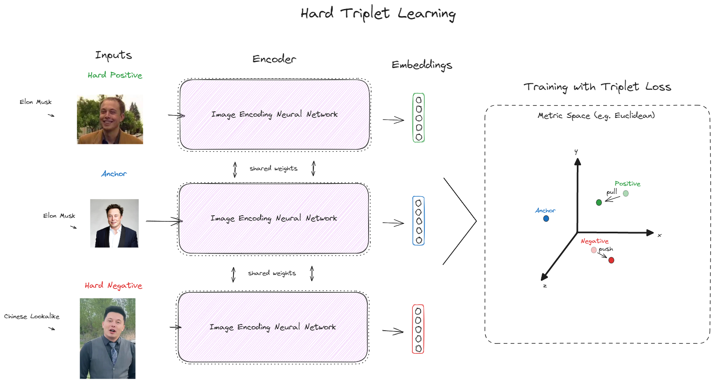
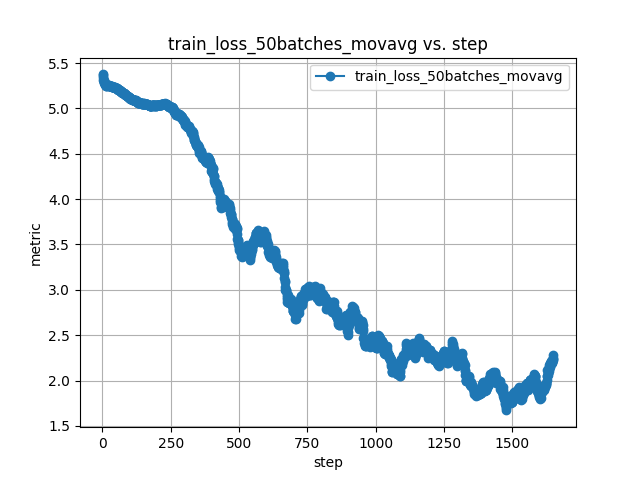
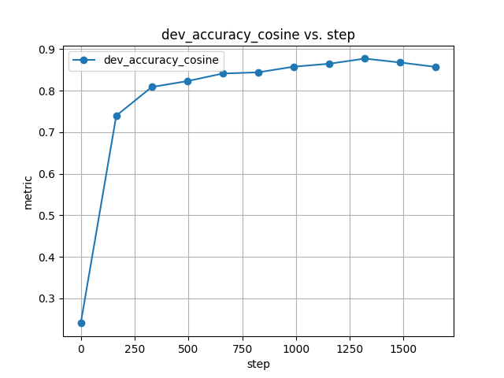
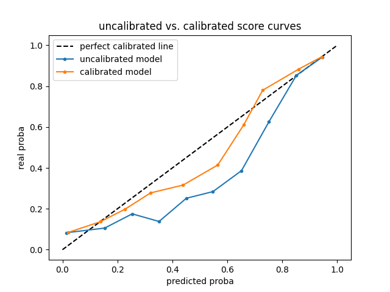
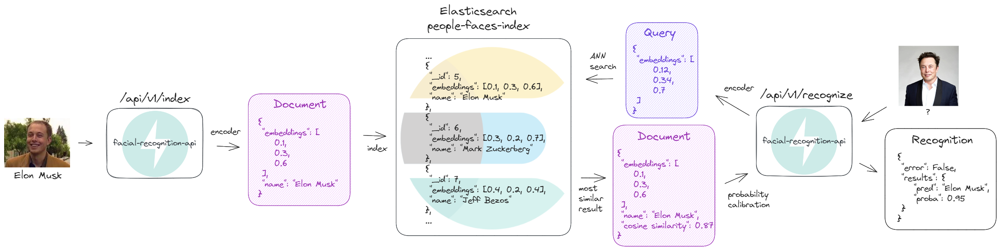
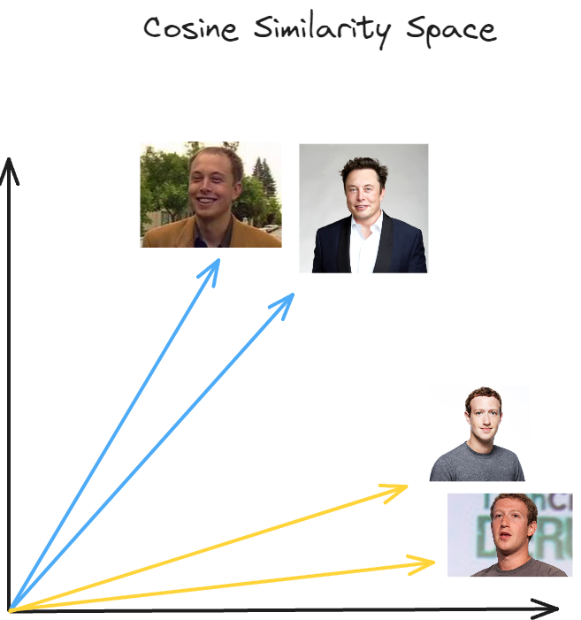

# full-stack-deep-facial-recognition
Leverage Metaflow, PyTorch, AWS S3, Elasticsearch, FastAPI and Docker to create a production-ready facial recognition solution. It demonstrates the practical use of deep metric learning to recognize previously unseen faces without prior training.

Streamlit demo:
ToDo

# Architecture
The (locally) implemented architecture, as is:



# Training Procedure
Overview of the used techniques and network architectures. 

## Data

### LFW
I'm using a dataset called ["Labeled Faces in the Wild" (LFW)](http://vis-www.cs.umass.edu/lfw/) that contains +13000 images of faces collected from the web. Sample images:
<p align="left">
  
   
  
  
  
</p>

### Augmentations

A large set of data augmentations are available. I used a high level of image augmentations, since we don't really have a lot of images. Here is an example of pre and post augmentation:

<p align="left">
  
  
</p>

### Splits
The dataset was train/dev/test randomly splitted by person_id, meaning different people are in different splits. I only included people that had at least two images, since thats the minimum for triplet mining (at least one positive sample per anchor).

Data was divided as follows:

* Training split: 1008 people (5299 images)
* Dev split: 336 people (1695 images)
* Test split: 336 people (2170 images)

## Modeling
### Pretrained Neural Network
I used an EffientNet (b0) that was trained (by paper authors) on ImageNet-1k and unlabeled JFT-300m using Noisy Student semi-supervised learning.  
Here is a diagram of how this works in practice:



### Finetuning
Since my objective here is to build a system capable of recognizing whatever person's face, traditional methods like multiclass classification were discarded.  
I finetuned this model via metric learning by online mined triplets, leveraging the [SuperTriplets](https://github.com/gabrieltardochi/supertriplets) python library. By doing this, the model learnt embeddings where capable of differentiating faces via cosine similarity.

**Online Mined Hard Triplets Loss**  

The concept of triplets is central to this technique. 
A triplet consists of three samples: an anchor, a positive, and a negative instance. In the supervised mode with multimodal data, an anchor could be an image of a dog and its caption, the positive sample another image of a different dog and its caption, while the negative sample could be an image of a different animal, let's say a cat, and its caption.

The goal of a model updated by a triplet loss is to correctly discriminate between positive and negative instances while also ensuring that the embeddings of positive instances are closer together than those of negative instances. However, randomly selecting triplets during training can lead to slow convergence and suboptimal results. To address this, we employ online hard triplet mining, where we dynamically select the hardest triplets during each training iteration. This focuses the training process on the most informative and challenging instances, leading to more robust representations.

Here is a scheme of one triplet loss optimization step (single triplet):
<p align="left">
  
</p>

**Optimization settings**

Here are the settings used during training:
* Criterion: BatchHardTripletLoss (standard batch hard triplet loss, with a margin param)
* Distance optimized during training: Euclidean
* Optimizer: AdamW
* Learning rate: 1e-3
* Weight decay: 1e-2
* Max epochs: 10
* Early stopping with frequent evaluation: saves best model, stops training given a patience of 3
* Training batch size: 32
* Image size: 224x224
* Image normalization: imagenet defaults
* Linear projection (last layer) output dimension: 300

<p align="left">
  
  
</p>

**Calibrating Face Matching Probabilities**

I also trained an `scikit-learn.isotonic.IsotonicRegression` estimator to calibrate face matching probabilities given the cosine similarity scores to make outputs as reliable as possible. It was fitted using the dev split, and tested on the test set:



# Production
Overview of the inference stack. 




## FastAPI

FastAPI is a modern, fast (high-performance), web framework for building APIs with Python 3.7+ based on standard Python type hints. It is used in this project to build the interface between the trained models/stack and potential users.

On startup, the API will connect to Metaflow/S3/Elasticsearch and load the encoder, probability calibration model and every other configuration needed for production (e.g. image preprocessing transforms, elasticsearch client).

There are two main endpoints in the `facial-recognition-api`:

### POST /api/v1/index

Uses the trained encoder to calculate the vector representation of an input image. Indexes a document in Elasticsearch with the person's name and embeddings, in the form of:
```json
{
  "embeddings": [0.12, 0.523, 0.32, 0.96, 0.04, 0.77],  // in practice im using 300d vectors
  "name": "Elon Musk"
}
``` 
Returns status and Elasticsearch message to the indexing tentative:
```json
{
  "error": false,
  "msg": "Created"
}
```

### POST /api/v1/recognize

Uses the trained encoder to calculate the vector representation of an input image. Uses this as a query to search Elasticsearch for the closest known (indexed) person. With the closest person similarity score in hands, the probability calibrator is invoked, and the calibrated prediction is returned:
```json
{
  "error": false,
    "results": {
      "pred": "Elon Musk",
      "proba": 0.95
  }
}
``` 

## Elasticsearch

Elasticsearch is a distributed search and analytics engine built on Apache Lucene. It is used here to store (and index) and search for faces, given embeddings. I configured an index with approximate nearest neighbor similarity search via cosine similarity enabled.

### Cosine similarity

Cosine similarity is a measure of similarity between two non-zero vectors of an inner product space. It is defined to equal the cosine of the angle between them, which is also the same as the inner product of the same vectors normalized to both have length 1.



*Embeddings of Elon Musk and Mark Zuckerberg faces in two dimensions.*

### Similarity Search

Similarity search is the most general term used for a range of mechanisms which share the principle of searching (typically, very large) spaces of objects where the only available comparator is the similarity between any pair of objects.

### Approximate Nearest Neighbor Search

Nearest neighbor search algorithms aim to find the closest data point(s) to a given query point from a dataset. In some cases, particularly when dealing with very large datasets, exact nearest neighbor search can be very computationally expensive (both in space and time, see "curse of dimensionality"), sometimes even impractical. 

To speed up the search, approximation methods are often used. It does reduce the quality of the search results, but in some domains, finding an approximate nearest neighbor is an acceptable solution.

# Usage
You will need:
* python3.10, python3.10-venv
* docker and docker-compose
* make

### Instructions
1. Clone this repo and follow the instructions there to start Metaflow stack: `https://github.com/gabrieltardochi/metaflow-docker-deployment` 
2. Run `make dev-venv` to create your venv. Also activate it with `source .venv/bin/activate`
3. Download and setup everything with `python project_setup.py`
4. Up your local architecture stack (S3 and Elasticsearch) by running `docker-compose -f docker-compose-infra.yaml up -d`. You might need to `sudo chown 1000:1000 es-data` and rerun if Elasticsearch fails to start.
5. Now you are ready to train with custom params. Check `python metaflow_train.py --help`
6. Once trained, update `.env` with the correct Metaflow training run
7. Build and run our facial recognition api by running: `docker-compose -f docker-compose-api.yaml up -d --build`
8. Docs are available at `localhost:8080/docs` 
9. Now you can also run the Streamlit Webapp with `streamlit run streamlit_webapp.py`
10. Index new faces or search interacting with the WebApp at `localhost:8501`

Theres a utility script `./index_people.sh` in case you want to batch index some people faces (people in `sample-faces/index`). You might need to `chmod +x index_people.sh` in order to run it.

Here are solutions for some common situations you might find yourself in:

* Check if ES is running fine: `curl http://localhost:${ES_API_PORT} -ku 'admin:admin'` 
* Delete the ES index: `curl -X DELETE "localhost:9200/people-faces-index"`
* Manually create the ES index: `docker-compose -f docker-compose-infra.yaml up facial-recognition-es-create-index`
* Get ES index metrics (such as number of docs): `curl -X GET "localhost:${ES_API_PORT}/${ES_INDEX}/_stats?pretty"`
