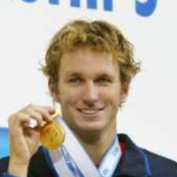

# full-stack-deep-facial-recognition
Leveraging metric learning via online mined hard triplets to easily scale and generalize a deeplearning-based Facial Recognition solution.

# Architecture
The proposed architecture, as is:

# Training Procedure
Overview of the used techniques and network architectures. 

## Data

### LFW
I'm using a dataset called ["Labeled Faces in the Wild" (LFW)](http://vis-www.cs.umass.edu/lfw/) that contains +13000 images of faces collected from the web. Sample images:

  
   
  
  
  

### Augmentations

A large set of data augmentations are available. I used a high level of image augmentations, since we don't really have a lot of images. Here is an example of pre and post augmentation:

  
  

### Splits
The dataset was train/dev/test randomly splitted by person_id, meaning different people are in different splits. I only included people that had at least two images, since thats the minimum for triplet mining (at least one positive sample per anchor).

Data was divided as follows:

* Training split: 1008 people (5299 images)
* Dev split: 336 people (1695 images)
* Test split: 336 people (2170 images)

## Modeling
### Pretrained Neural Network
I used an EffientNet (b0) that was trained (by paper authors) on ImageNet-1k and unlabeled JFT-300m using Noisy Student semi-supervised learning.  
Here is a diagram of how this works in practice:

  

### Finetuning
Since my objective here is to build a system capable of recognizing whatever person's face, traditional methods like multiclass classification were discarded.  
I finetuned this model via metric learning by online mined triplets, leveraging the [SuperTriplets](https://github.com/gabrieltardochi/supertriplets) python library. By doing this, the model learnt embeddings where capable of differentiating faces via cosine similarity.

**Online Mined Hard Triplets Loss**  

The concept of triplets is central to this technique. 
A triplet consists of three samples: an anchor, a positive, and a negative instance. In the supervised mode with multimodal data, an anchor could be an image of a dog and its caption, the positive sample another image of a different dog and its caption, while the negative sample could be an image of a different animal, let's say a cat, and its caption.

The goal of a model updated by a triplet loss is to correctly discriminate between positive and negative instances while also ensuring that the embeddings of positive instances are closer together than those of negative instances. However, randomly selecting triplets during training can lead to slow convergence and suboptimal results. To address this, we employ online hard triplet mining, where we dynamically select the hardest triplets during each training iteration. This focuses the training process on the most informative and challenging instances, leading to more robust representations.

Here is a scheme of one triplet loss optimization step (single triplet):

  

**Optimization settings**

Here are the settings used during training:
* Criterion: BatchHardTripletLoss (standard batch hard triplet loss, with a margin param)
* Distance optimized during training: Euclidean
* Optimizer: AdamW
* Learning rate: 1e-3
* Weight decay: 1e-2
* Max epochs: 10
* Early stopping with frequent evaluation: saves best model, stops training given a patience of 3
* Training batch size: 32
* Image size: 224x224
* Image normalization: imagenet defaults
* Linear projection (last layer) output dimension: 300

After training, I trained an `scikit-learn.isotonic.IsotonicRegression` estimator to calibrate the dev set cosine similarity scores to make outputs as reliable as possible.

# Usage
You will need:
* python3.10
* docker and docker-compose
* make

## Instructions

1. Clone this repo and follow the instructions there to start Metaflow stack: `https://github.com/gabrieltardochi/metaflow-docker-deployment` 
2. Run `make dev-venv` to create your venv. Also activate it with `source .venv/bin/activate`
3. Download and setup everything with `python project_setup.py`
4. Up your local architecture stack (S3 and Elasticsearch) by running `docker-compose -f docker-compose-infra.yaml up -d`
5. Now you are ready to train with custom params. Check `python metaflow_train.py --help`
6. Once trained, update `.env` with the correct Metaflow training run
7. Build and run our facial recognition api by running: `docker-compose -f docker-compose-api.yaml up -d --build`
8. Docs are available at `localhost:8080/docs` 
9. Now you can also run the Streamlit Webapp with `streamlit run streamlit_webapp.py`
10. Index new faces or search interacting with the WebApp at `localhost:8501`

Theres a utility script `./index_people.sh` in case you want to batch index some people faces (people in `sample-faces/index`).
